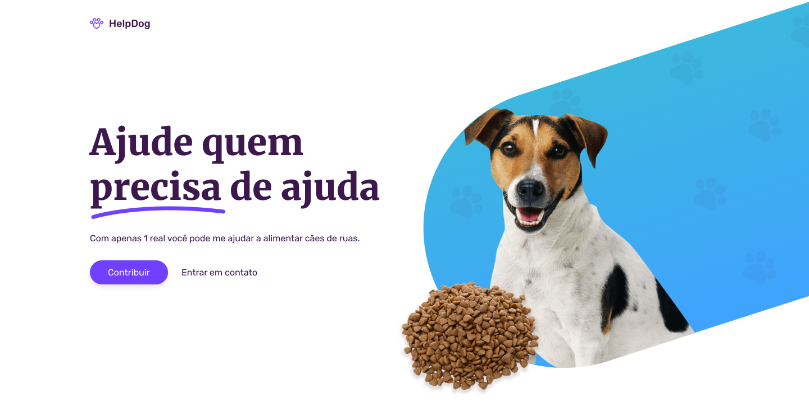

<h1 align="center">
  🐶 HelpDog
</h1>

Criação de uma página completa utilizando HTML e CSS durante uma <a href="https://www.twitch.tv/videos/1242261985">live</a>.

Desafio criado por: <a href="https://www.figma.com/file/Yb9IBH56g7T1hdIyZ3BMNO/Desafios---Codel%C3%A2ndia?node-id=32505%3A4">Iuri Code</a>

